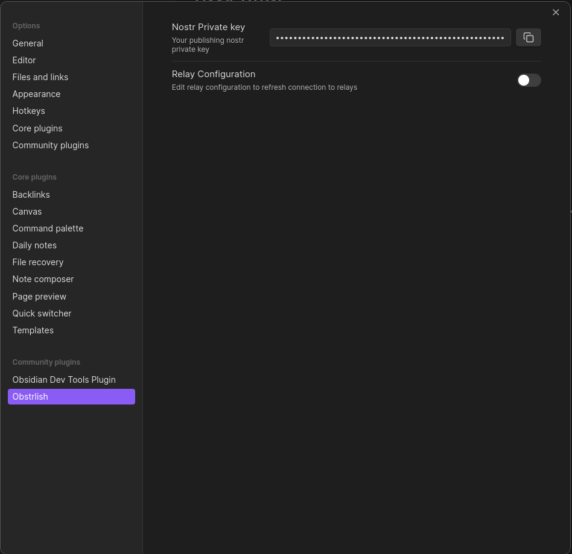

# Obstrlish

An Obsidian plugin that enables the publishing of long form articles to the Nostr Protocol. 

Nostr is an open protocol with a rapidly expanding suite of tools, simplifying the integration of Nostr across various 
corners of the Internet. 

1. **Native Markdown Support:** To begin, Obsidian employs plain text Markdown formatting for notes, just like all 
Nostr-based blogging platforms. This makes it an ideal choice for creating, formatting, and editing Nostr posts.

2. **Illustrative Preview:** While other blogging platforms offer preview tools, Obsidian has perfected this feature. 
It provides a beautifully customizable preview window that can be positioned anywhere in your workspace, allowing you 
to visualize how formatting, media, and embeds will appear in the published post

3. **State-of-the-Art Flexibility:** Since 2020, Obsidian has continuously improved the way writers interact with it. 
What sets it apart is not only the dedicated team but also its thriving community, all contributing to its refinement. 
Obsidian supports an extensive array of plugins, shortcuts, and hotkeys, offering unparalleled flexibility and 
customization. Comprehensive [documentation](https://help.obsidian.md/Home) and a ton of [videos](https://www.youtube.com/results?search_query=obsidian) 
and even [courses](https://youtu.be/WqKluXIra70?si=3ZlnOZA9o3xXys8M) on YouTube provide a wealth of information to 
tailor Obsidian to your preferences.

4. **Boosted Productivity:** The Nostr Writer plugin is a game-changer for power users of Obsidian. If you're already 
using Obsidian for note-taking, employing this tool to publish your notes on Nostr is a no-brainer. If you haven't 
explored it yet, I strongly recommend giving it a try. It has the potential to transform how you think, plan, and 
structure your ideas for the better. Trying it for broader objectives will help you appreciate how well it complements Nostr.

5. **Distraction-Free Composition:** While you may disagree, browsers can be a significant source of distraction, 
with constant alerts, notifications, and blinking extensions. Composing within Obsidian offers a tranquil, 
clutter-free experience, fostering focus and productivity.

## 🚀 Installation

The plugin can be installed from within Obsidian.

### Obsidian Community Plugin Browser

- Go to `Settings` -> `Community plugins`
- Make sure `Restricted mode` is **off**
- Click `Browse`
- Search for `obstrlish`
- Click `Install` and then `Enable`

## 🛠️ Usage

Once the plugin has been installed open your 

## ✍️ Feedback and Contributions

If you encounter any issues or have feedback on the plugin, feel free to open an issue on the [GitHub repository](https://github.com/threenine/obstrlish). 
